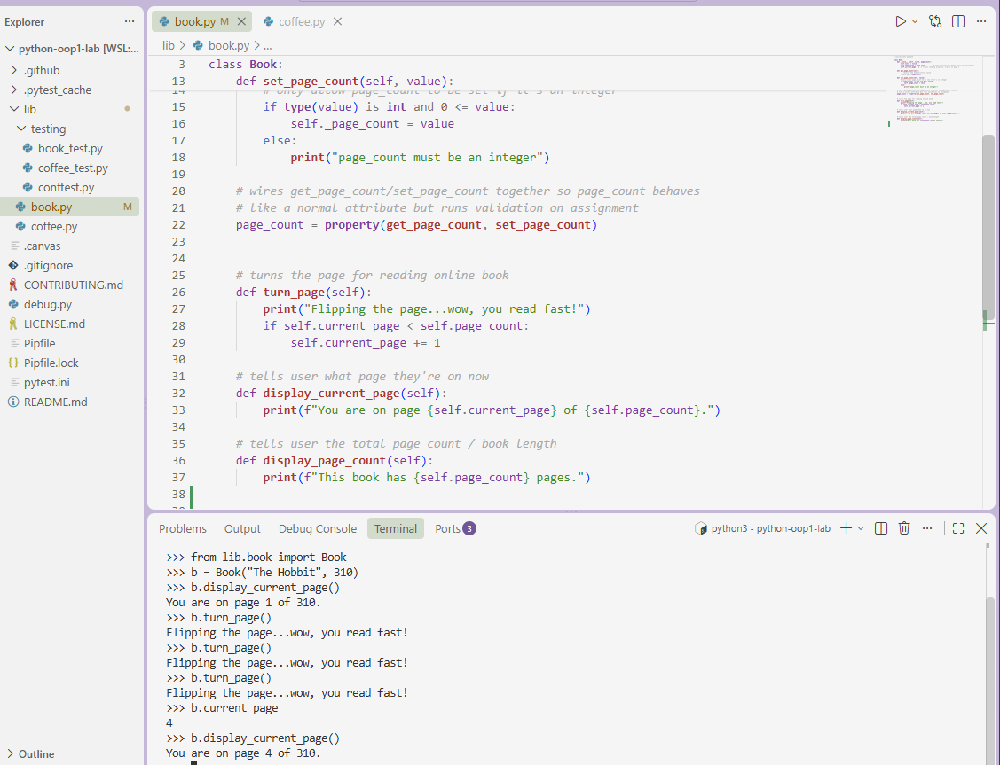

## Book and Coffee OOP Lab

This project models a bookstore using two classes: `Book` and `Coffee`.

### Book (`lib/book.py`)
- Initialized with a `title` and `page_count`.
- `page_count` is a validated property — only integers are accepted; invalid
  values print `"page_count must be an integer"` and leave the previous
  value unchanged.
- `current_page` tracks reading progress, starting at page 1.
- `turn_page()` prints a message and advances `current_page` (capped at
  `page_count`, so it can't exceed the total).
- `display_current_page()` prints the reader's current progress.
- `display_page_count()` prints the book's total page count.

### Coffee (`lib/coffee.py`)
- Initialized with a `size` and `price`.
- `size` is a validated property — only `"Small"`, `"Medium"`, or `"Large"`
  are accepted; invalid values print `"size must be Small, Medium, or Large"`.
- `tip()` prints a thank-you message and adds $1 to the coffee's `price`.

### Testing
All functionality is covered by tests in `lib/testing/`. Run them with:

```
pytest lib/testing/book_test.py
pytest lib/testing/coffee_test.py
```

### Screenshot
